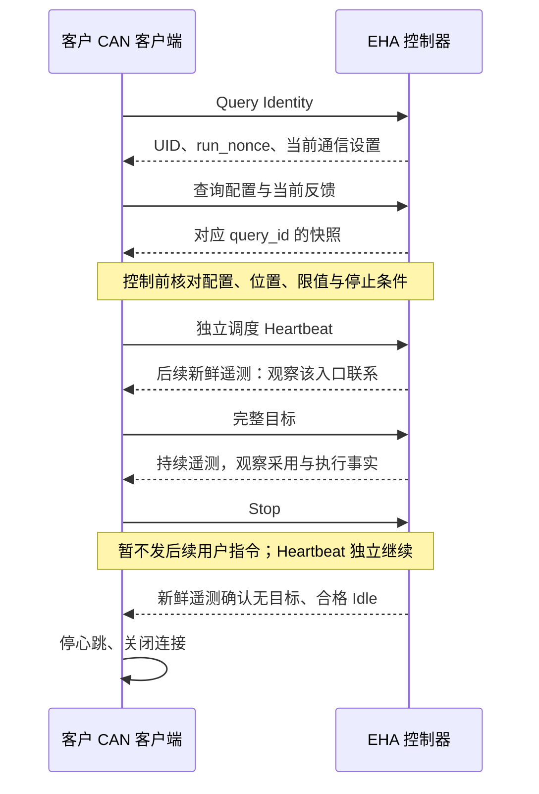

<!-- Copyright The eha-sdk Contributors -->

# 客户 CAN 接入指南

本指南组织自行实现 CAN 客户端的接入顺序，不要求 Rust SDK。线上字节和分片以
[公共应用通信协议](docs/通信协议/公共应用通信协议.md)、[CAN 绑定](docs/通信协议/CAN通信绑定.md)为准；
目标、停止和结果处理共用[公共交互规则](README.md#公共交互与结果)。

## 接入前提与职责

部署方提供控制器本次启动采用的节点号、Classic／FD 配置组和总线访问条件。节点号
`config.external_can.id` 是逻辑值，不是原始 CAN ID；不能猜测默认值，或用同型设备、USB
描述符替代身份。取得 Identity 后再读配置视图核对实际设置。

| 客户端负责 | 实现要点 |
|---|---|
| 完整消息 | 公共头、精确长度和 CRC32C；不补字段，不把 CAN 填充计入消息 |
| 分片与重组 | 冻结完整消息；维护每方向、节点、通道的编号保护、组装期限和通信世代 |
| 查询关联 | 非零且递增、不复用的 `query_id`；Identity 后绑定 UID、`run_nonce` 和类别 |
| 联系维持 | 独立调度显式 `Heartbeat`；普通流量和本地定时器不能代替设备收到心跳 |
| 维护关联 | 保存维护键与候选；超时或断连后查询原结果和实际状态，不自动重发 |

## 主机 CAN 通道

CAN 适配器是操作系统和驱动的资源，不是 EHA SDK 或官方工具管理的设备。部署方负责选择实际设备、安装驱动、授予进程访问权限、设置总线模式与速率，并在故障后按本地运行规程处理。SDK 只接收一个可以发送和接收原始 CAN 帧的 `CanChannel`；它不枚举 USB、串口或 PCI 设备，不识别厂商，不设置比特率，也不执行适配器复位或恢复。

Python 不是公共协议或 Rust SDK 的必需依赖。Rust 应用可以通过 `CanChannelFactory` 接入自己的系统服务或驱动。官方工具当前选择 `python-can`，用于复用其多种设备后端及统一的帧接口；这是第三方驱动接入方案，并非三个操作系统共同提供的原生 CAN 标准。选择该方案需部署 Python 运行时，并承担进程通信开销；具体平台、设备与帧格式的可用性仍由外部驱动决定。

官方 `eha-tool` 将 `--can-channel CONTEXT` 交给一个持久的通用 `python-can` 进程。该进程使用
`python-can>=4.6.1,<5` 的命名配置上下文打开驱动，转发原始帧，并在关闭时释放该通道；它不包含任何适配器的专用协议。可在驱动的 `can.conf`／`can.ini` 中定义上下文，例如：

```ini
[EHA_PRODUCTION]
interface = <外部驱动接口名>
channel = <该驱动的通道>
fd = true
```

也可为隔离部署设置 `CAN_CONFIG_EHA_PRODUCTION` 为等价 JSON 配置；变量名后缀必须逐字匹配 `--can-channel EHA_PRODUCTION`。每个上下文都应显式给出 `interface` 和 `channel`，避免拼写错误回退到默认通道。权限、终端、仲裁／数据速率和其他驱动属性均由所选驱动的文档决定；示例中的占位符不是可直接使用的驱动设置。参见 [python-can 配置说明](https://python-can.readthedocs.io/en/stable/configuration.html) 与 [总线接口](https://python-can.readthedocs.io/en/stable/bus.html)。

`--can-mode classic|fd` 和 SDK 的 `transport::can::Mode` 只选择 EHA CAN 绑定所要求的帧形态，必须与控制器实际启动配置一致；它们不配置主机设备。请求 `fd` 时，所选操作系统、驱动和设备都必须实际支持 CAN FD 与 BRS。驱动打开、写调用返回或工具显示“已连接”只证明本地通道阶段的事实，仍须在该通道执行 `identify` 并核对返回的身份和通信设置。通道故障会结束本次连接；工具和 SDK 不自动更换设备、重置驱动或重放帧。

## 报文定义入口

Classic 和 FD 重组后的完整消息须逐字节一致。按下表实现规则，再用样例核对：

| 需要实现的部分 | 唯一维护位置 |
|---|---|
| 公共消息头、长度、字节顺序、CRC32C | [完整消息与基本表示](docs/通信协议/公共应用通信协议.md#2-完整消息与基本表示) |
| 命令、回复及各业务字段 | [消息目录](docs/通信协议/公共应用通信协议.md#3-消息目录)和[公共交互与结果](README.md#公共交互与结果) |
| 节点号、速率配置与 Classic／FD 帧形态 | [启动配置与帧形态](docs/通信协议/CAN通信绑定.md#1-启动配置与帧形态) |
| 扩展 ID 的组成、方向、通道、传输编号与片序 | [扩展标识符](docs/通信协议/CAN通信绑定.md#2-扩展标识符) |
| 分片长度、DLC 与末片填充 | [公共消息和分片载荷](docs/通信协议/CAN通信绑定.md#3-公共消息和分片载荷) |
| 乱序、重复、超时、编号重用及连接恢复 | [组装、失效和重连](docs/通信协议/CAN通信绑定.md#4-组装失效和重连) |
| 实际发送结果与完整消息交付的区别 | [接收分类和发送边界](docs/通信协议/CAN通信绑定.md#5-接收分类和发送边界) |

## 查询、心跳与维护结果



遥测独立发布，不是逐心跳或逐目标确认；图中箭头不承诺消息送达或指令被采用。`Stop` 与查询、目标、维护共用最新消息槽；
连续发送 Stop 和查询不能证明停止执行。首次 Identity 查询可尚不知道运行实例，后续
`Query`、`ReadConfig`、`ReadResult` 必须按[运行实例与快照](docs/通信协议/公共应用通信协议.md#4-运行实例快照和通用字段)关联回复。

维护使用 UID、`run_nonce`、递增 `operation_id` 组成的键。结果查询、留存和释放见
[维护结果会话](docs/通信协议/公共应用通信协议.md#10-维护结果会话)：本地发送、CAN ACK 或预期断连不证明业务完成；
`OperationResult`、`DataUnavailable`、实际记录读回分别表达操作事实、不可取得事实和可供比较的字节。

## 可核对报文

使用[公共协议的可复算样例](docs/通信协议/公共应用通信协议.md#13-可复算样例与失败场景)
与[CAN 绑定的代表性承载](docs/通信协议/CAN通信绑定.md#8-代表性承载)核对独立实现：

| 场景 | 核对内容 |
|---|---|
| 主机 Heartbeat | `node=1`、主机到固件、`transfer_id=1` 的扩展 ID、8 B 数据与 Classic／FD 一致的承载。 |
| Position `10 mm` | 同一完整 12 B 公共消息在 Classic 的两帧与 FD 的一帧之间逐字节重组一致。 |

这些例子只证明编码、分片和重组是否符合合同；不证明目标已采用、控制仍获准、设备已经
执行，或维护操作已经完成。
