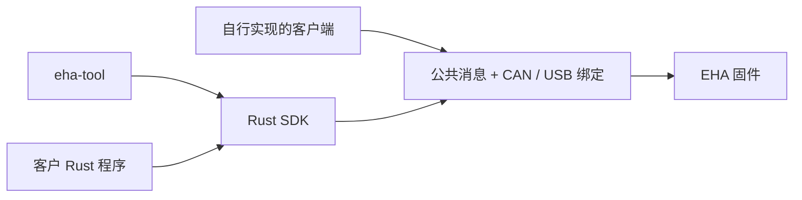
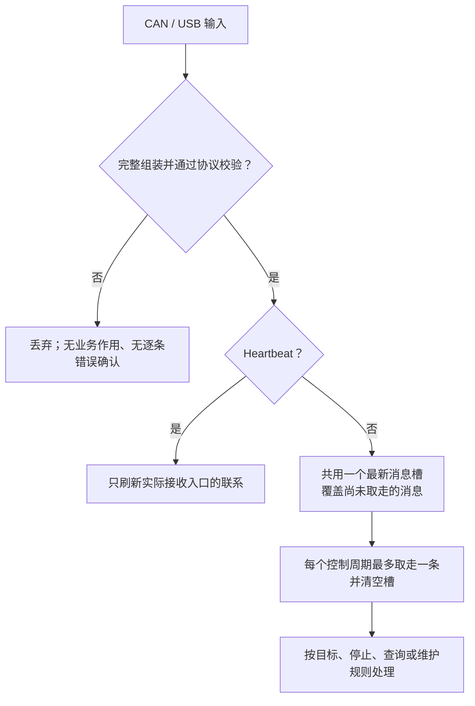

<!-- Copyright The eha-sdk Contributors -->

# EHA SDK 与官方工具

通过 CAN 或 USB 查询、控制和维护 EHA。可以使用官方工具、编写 Rust 程序，也可以按公开协议自行实现客户端。

| 使用方式 | 入口 |
|---|---|
| 官方工具 | [`eha-tool` 的 CLI、Shell 与 WebUI](crates/tool/README.md) |
| Rust 程序 | 下方[最小调用](#最小-rust-调用)、rustdoc 和[示例](#示例与检查)；CAN、USB 共用 `host::Client` |
| 自行实现 CAN 客户端 | [CAN 接入指南](CAN接入指南.md)，不依赖 Rust SDK |
| 实现编解码或传输 | [公共应用通信协议](docs/通信协议/公共应用通信协议.md)、[CAN 绑定](docs/通信协议/CAN通信绑定.md)、[USB 绑定](docs/通信协议/USB通信绑定.md) |



本仓维护公共行为、线上合同、配置格式和客户端；firmware 仓库维护控制算法、平台接入、存储实现和产品出厂参数。
三份通信合同分别维护完整消息、CAN 帧和 USB 字节流，独立客户端可据此实现互通。开发入口见[贡献指南](CONTRIBUTING.md)。

## 公共交互与结果

本节维护所有接入方式共用的客户可观察行为；精确字段和阶段见通信合同，Rust API 参数与生命周期见 rustdoc。

### 指令怎样被处理



CAN 与 USB 合计只支持**一个调用方串行提交**，无需等待上一条的接纳、执行或遥测。除独立 `Heartbeat` 外，所有类型合计正常最高 **1000 Hz**，一条指完整组装且校验通过的消息。短时密集或持续超频仍按最新消息处理，超频本身不停止或复位；这不承诺逐条执行、端到端时延或任一 CAN 配置下的组合带宽。

| 最新消息规则 | 对调用方的影响 |
|---|---|
| 所有类型没有优先级，内容相同也算新消息 | **尚未取走的 `Stop` 可被后续查询、目标或维护请求覆盖** |
| 同入口按完整消息恢复顺序交付；跨入口不还原物理到达先后 | 分片到达先后不决定业务处理顺序 |
| 取走后清空，新消息留到后续周期；空槽不重放 | 不恢复已结束目标；覆盖消息也不取消已开始操作 |
| 未收齐、组装超时或校验失败的输入直接丢弃 | 不刷新联系、不改目标、不开始维护、不写配置 |
| 格式合法后仍须满足业务条件 | 目标可被拒绝，维护可报告未开始 |

### 目标、心跳与停止

`Position`、`Velocity`、`Force` 各携带一个有限值；`Impedance` 同时携带平衡位置、刚度和阻尼。目标持续有效，没有字段补丁、隐含到位、时长或逐条接纳确认；**零值不是停止**。

| 事件 | 对当前目标的影响 |
|---|---|
| 获准的新目标 | 整份替换模式和参数，并关联实际 CAN 或 USB 入口 |
| 新目标被拒绝 | 不排队；拒绝本身不改变旧目标 |
| 关联入口的完整合法 `Heartbeat` | 维持该入口联系；连接、目标、查询、遥测和其他流量均不能代替 |
| 另一入口的心跳或目标 | 心跳不续期、不接管；目标不采用、不排队、不改变原目标 |
| 任一入口的 `Stop` **被取走** | 清除当时目标；再次控制须提交新目标 |
| 保护、入口失联或设备条件结束目标 | 条件或联系恢复后，仍须提交新目标 |

### 如何解释结果

| 取得的证据 | 可以说明什么 | 后续处理 |
|---|---|---|
| `LocalSubmission` | CAN 通道 `send` 或 USB 最后一个 Bulk 包在本地完成 | 另观察新鲜状态；不证明 CAN ACK、固件接收、目标采用、驱动执行或运动 |
| `Reply` | 主机取得并解码回复 | 按回复内容解释；快照不等于当前状态 |
| `NotStarted` | 本次维护副作用尚未开始 | 修正条件后以新维护键明确提出下一次操作 |
| `ResultUnknown` | 已发操作的结果尚不明确 | 保留维护键，重连后 `identify`，查询原结果及实际状态；不自动重发 |
| 同设备保存读回一致 | 实际记录与候选逐字节一致 | 另行启动后核对采用；不证明已重启或生效 |

查询和遥测需分别保留数值、质量、来源年龄、快照时间和主机收到时间。缓存、转发或重新读取不刷新数据；过期、断连前或不同运行实例的数据不能当作当前状态。

保存、恢复出厂、复位和进入更新均以维护键关联结果。`ResetApplication`、`EnterUpdate` 可能在回复前结束应用；后者仅切换更新入口，不传镜像。复位或外部更新后，核对同一 UID 的新应用实例、版本和启动配置。

## 依赖与连接能力

`eha-sdk` 是独立 Cargo 工作区，包含根包、`protocol`、`transport`、`eha-config` 和官方
`eha-tool`。二次开发使用同一修订的完整仓库及 `Cargo.lock`，不拼接不同修订的路径依赖；版本来自
`workspace.package.version`。独立克隆、依赖和检查见[贡献指南](CONTRIBUTING.md)。

| 通路 | 当前 SDK 能力与限制 |
|---|---|
| USB Type-C | `usb::discover` 只列出 `1209:0001` 候选；`UsbConnector::new(完整序列号)?.open()` 按实际描述符认领唯一 64 B Bulk IN/OUT 对。它不发 USB reset 或控制请求；打开后仍须 `identify`。 |
| 外部 CAN | `CanChannel` 是已配置通道上的原始帧 I/O，调用方以 `CanChannelFactory` 提供它；SDK 不发现、初始化或配置物理 CAN 设备。`CanOptions { node, mode }` 只描述 EHA 节点和 Classic／FD 帧形态。官方工具通过外部 `python-can` 上下文取得通道；平台、驱动和设备须实际支持所请求的帧形态。完整部署方法见 [CAN 接入指南](CAN接入指南.md#主机-can-通道)。 |

打开 CAN 通道或认领 USB 接口只证明本地资源取得；首次业务操作必须在同一通路
`Client::identify`，必要时提供预期 UID。描述符、CAN 节点或同型设备都不能替代身份。
USB 认领失败或 CAN 通道不能打开，可能是占用、权限、系统或驱动问题；若确认旧会话存在，先在旧会话显式
`stop_control` 并观察状态，再释放连接。

## 最小 Rust 调用

`CanConnector` 或 `UsbConnector` 打开后提供 `host::Backend`，再由 `host::Client` 调用
身份、查询、遥测、心跳、控制和维护 API。`Wait` 只限定本地提交或回复等待；不取消已发送
操作，也不构成设备停止。

```rust,no_run
use std::{sync::Arc, time::Duration};
use eha_sdk::{
    can::{CanChannelFactory, CanConnector, CanOptions},
    host::{Client, Wait},
    transport::can::Mode,
};

fn query(factory: Arc<dyn CanChannelFactory>) -> Result<(), String> {
    let mut connector = CanConnector::new(CanOptions {
        node: 1,
        mode: Mode::Fd,
    }, factory)?;
    let backend = connector.open()?;
    let mut client = Client::new(backend);
    let wait = Wait::new(Duration::from_secs(5));
    client.identify(None, &wait).map_err(|error| error.to_string())?;
    client.status(&wait).map_err(|error| error.to_string())?;
    client.close();
    Ok(())
}
```

应用程序在 `CanChannelFactory::open()` 中接入自己的系统／驱动服务；SDK 只调用通道的 `send`／`receive`，
不会解释厂商设备协议或指定比特率。官方工具已提供外部 `python-can` 接入实现，调用时以命名通道上下文选择。
USB 仅替换为 `UsbConnector::new("完整 USB 序列号")?.open()`。控制前核对身份、配置、
当前位置、限值和停止条件，调用 `start_heartbeat` 并从新鲜遥测确认联系；结束时显式
`stop_control`，观察无目标和合格 Idle 后再 `stop_heartbeat`、关闭连接。

关闭、`Drop`、`disconnect`、普通错误、取消和超时都不发送 Stop、Reset、Heartbeat，也不重放
旧目标。`disconnect()` 的 `ClientState` 只用于同一 Connector 重开后的 `Client::resume`；
新 Client 必须重新 `identify`，心跳不会自启。不要新建 Connector、重开进程或切换 CAN 设备来绕过
`transfer_id` 保护期；重新打开成功仍只证明本地资源取得。

## 配置检查

`configuration::validate_json` 不访问设备。它以 [`eha-config`](crates/config/README.md) 的
schema、字段表示和纯换算为基础，检查完整记录、跨字段关系、派生值和名义心跳周期；不补齐
字段、不重排 JSON，也不证明目标固件、现场设备或安装方向匹配。`begin_save` 与
`save_and_readback` 只报告本地提交、固件结果和同设备实际读回；结果已结清后才可显式
`release_result` 与 `confirm_released`。

## 独立 ODrive 读取

默认 `desktop` feature 的 `eha_sdk::odrive` 只读地发现或读取调用方明确指定的 ODrive USB
序列号。它不自动选择设备，不清错、重启、保存、标定、喂狗或提交控制。EHA 的
`Status`/`Telemetry`/`Diagnostics` 与 ODrive USB 快照没有共同时间或身份基准，必须分别保留
来源和读取时间，不能合成为原子双板状态或据此断言内部 CAN 正常。

## 示例与检查

[`reconnect_readonly`](examples/reconnect_readonly.rs) 演示同一 `UsbConnector` 的只读重开：

```sh
cargo run -p eha-sdk --example reconnect_readonly -- usb <完整 USB 序列号>
```

[`board_check`](examples/board_check.rs) 通过公开 SDK 查询、心跳、停止和维护读回；它不创建
运动目标。USB 的实际调用形式为 `cargo run -p eha-sdk --example board_check -- usb SERIAL OUTDIR`；
`decode` 模式只解码已有原始回复，示例不自动复位或重发。

构建与软件检查统一按[贡献指南](CONTRIBUTING.md#构建与检查)执行，并按改动影响选择范围。
软件检查不访问设备，不能代替实板收发、读回或设备执行证据。

业务工程量采用 `f32`（IEEE 754 binary32）；输入由原始文本按最近取偶一次舍入，非有限、溢出及非零输入下溢为零时拒绝。SDK、CLI、Shell 和 WebUI 使用同一数值边界；正负零业务等价，时间计数使用整数。完整约定见[公共应用通信协议](docs/通信协议/公共应用通信协议.md)。
