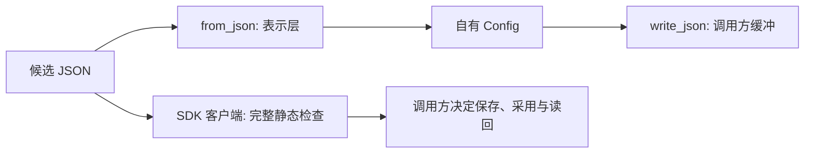

<!-- Copyright The eha-sdk Contributors -->

# `eha-config`

## 职责与依赖

`eha-config` 是硬件无关、无堆分配的 `no_std` 配置记录库。它拥有字段类型、记录版本、完整 JSON 编解码、JSON Schema 文本及液压速度到泵转速的纯换算；只依赖 `serde` 与 `serde-json-core`，不依赖固件、存储、同步原语、平台或产品出厂配置。

## 公开接口与使用

`Config::from_json` 从完整的版本化 JSON 记录返回自有 `Config`；`write_json` 把该记录写入调用方缓冲并返回有效前缀长度。`FORMAT_VERSION` 和 `MAX_JSON_LEN` 是记录边界，`JsonError` 说明表示层失败。启用 `schema` feature 时，`SCHEMA_JSON` 导出同目录 [`schema.json`](schema.json) 供主机使用；固件不链接 Schema。

`hydraulic_velocity_to_rpm` 按线速度（mm/s）、有效面积（mm²）与泵每转排量（cm³/rev）计算无安装方向的 rpm，保留速度符号；它只拒绝 NaN、无穷或产生非有限中间结果，静态正值条件和最终输出授权仍由调用方处理。

## 实现约定

记录不保存原始 JSON，也不分配内存。解析拒绝未知/缺失字段、非有限数值和不支持的版本；编码只写调用方缓冲，失败时缓冲可能已部分改变，不能保存。

`schema.json` 只维护字段类型、固定范围、单位和参数说明；它不含默认值、项目私有关键字或产品数据。完整静态检查由[SDK 客户端](../../README.md#配置检查)维护。

## 错误与结果边界

解析或编码成功只证明记录可表示，不能证明字段关系、保护范围、设备匹配、维护许可或启动采用。此 crate 不读写存储、不补默认值、不选择用户/出厂记录、不发布启动快照；`JsonError` 与 `HydraulicConversionError::NonFinite` 也不表示业务参数适用性。

## 代码与验证入口

crate 根 rustdoc 维护精确字段、JSON 错误和版本语义，`schema.json` 是主机静态校验输入；单元测试覆盖表示层拒绝和纯换算。检查入口见[贡献指南](../../CONTRIBUTING.md)。
