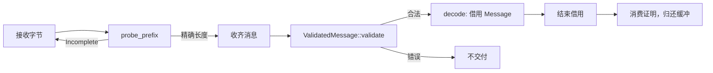

<!-- Copyright The eha-sdk Contributors -->

# `protocol`

## 职责与依赖

`protocol` 是完整公共应用消息的纯 `no_std` 编解码库：唯一实现公共头、长度、方向、CRC-32C 与字段格式校验。线上字段和条件以[公共应用通信协议](../../docs/通信协议/公共应用通信协议.md)为准；CAN、USB 与业务层复用本 crate，不自行解释字节。

它不做 I/O、控制准入、维护许可、保存、复位或设备结果判定。配置记录只作为借用的原始字节通过：[`eha-config`](../config/README.md)拥有记录类型和 JSON 表示，SDK 客户端拥有完整静态检查。

## 公开接口与使用

接收方先探查前缀，再只对精确的完整消息建立校验证明；证明持有借用字节，因而解码不重复 CRC 或字段校验。`Message` 和大配置记录同样借用输入，所有借用结束前不得复用缓冲。

前缀合法只说明所需长度，调用方仍须收齐字节后才能校验。传输绑定持有可变接收缓冲时使用 `validate_buffer`，并在结束后以 `into_bytes` 取回整块缓冲；完整流程见 [`transport`](../transport/README.md#公开接口与使用)。

发送方使用 `encode` 或具名 `responses::encode_*` 写入最终输出缓冲；大 `ConfigData` 以 `ConfigDataWriter` 直接取得其中的记录窗口，填入原始读回字节后 `finish`。`encode_in_place` 适用于调用方已填好载荷的最终缓冲。成功返回的精确长度才是有效消息；失败时头或 CRC 可能已写入，不得提交该缓冲。

需要跨缓冲或进程保存维护键时，将借用的 `OperationKey` 转为 `OperationKeyFields`；它只保存合同中的键字段，不能证明操作已经开始、完成或可重放。具体类型、消息种类和编码器参数见 rustdoc。

`ValueFields::from_f32` 仅将内部观测投影到协议的 `f32` 字段：保留来源质量和过期事实；非有限时，以 `CalculationFailed` 与正零占位。有限值保持位模式（含次正规数、正负零），其他不可用状态保持分类并用正零占位；它不改写内部数值、控制历史或保护事实。

## 实现约定

校验为无堆分配的 O(L) 操作，最大完整消息为 16,440 B，其中配置记录最多 16,384 B；峰值缓冲由绑定或应用所有者提供。`ValidatedMessage` 将校验过的精确字节、方向和摘要绑定，避免以未校验切片和摘要重新拼接消息；回复视图的 `fields()` 返回具名值，仍借用的文本、诊断迭代项与 `ConfigData::data` 则随输入寿命结束。

## 错误与结果边界

`Prefix::Complete` 仅说明可确定完整长度，不能刷新联系或更新业务缓存。格式错误表达版本、类型、方向、长度、CRC、字段或容量问题，并非业务拒绝。完整合法的心跳、目标、查询和维护请求仍由调用方交给相应入口；编解码成功不能说明传输已提交、对端已收、设备已执行或业务已完成。

## 代码与验证入口

crate 根 rustdoc 是精确 API、字段与错误说明；[`examples/observations.rs`](examples/observations.rs)展示具名回复编码和解码，`tests/` 覆盖格式场景。检查入口见[贡献指南](../../CONTRIBUTING.md)。这些测试只证明字节格式，不证明固件任务、传输时序、设备通信或业务执行。
