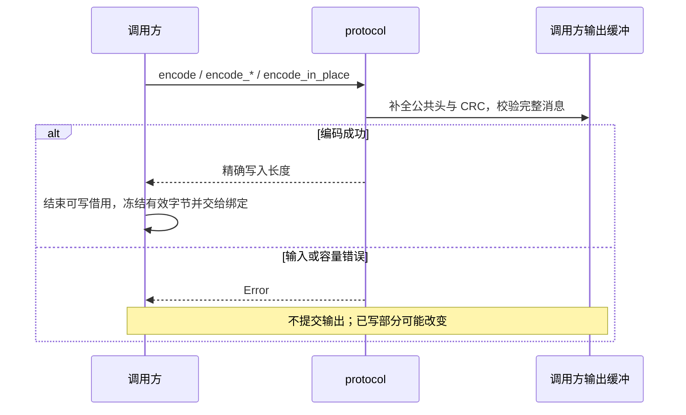
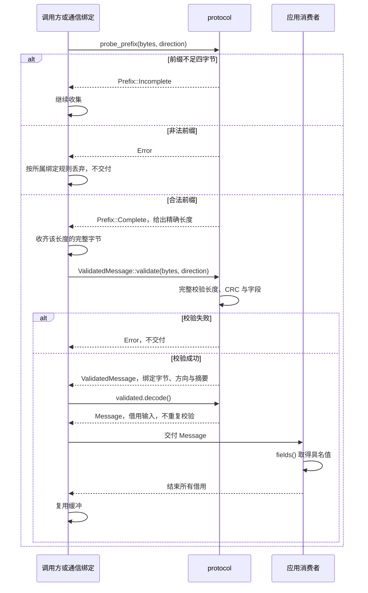

<!-- Copyright The eha_controller Contributors -->

# `protocol`

## 职责与依赖

`protocol` 是完整公共应用消息的纯 `no_std` 编解码库；它不依赖 `alloc`、平台、配置、传输驱动或业务 crate。线上字段、方向、CRC 和消息格式条件由[公共应用通信协议](../../docs/通信协议/公共应用通信协议.md)唯一维护。CAN 和 USB 绑定只用本 crate 判定公共前缀、校验完整字节和取得借用视图。

本 crate 不执行 I/O，不判断目标是否可采用，也不执行保存、复位、更新或维护会话。传输本地提交、对端接收、设备执行和业务完成均不属于编解码结果。配置内容仅借用原始字节；完整记录的解析和目标类型表示由[`eha-config`](../config/README.md)维护，静态约束及检查由其[`schema.json`](../config/schema.json)和根包的[配置检查](../../README.md#配置检查)维护。

## 公开接口与使用

`probe_prefix(bytes, direction)` 在不足四字节时返回 `Prefix::Incomplete`；前缀合法时给出精确完整长度。收齐该长度后，`validate` 保持仅返回 `MessageInfo` 的兼容入口；`ValidatedMessage::validate` 则把精确字节、方向和摘要封装为不可伪造的校验证明，随后 `decode()` 返回借用输入的 `Message` 而不重复完整校验。传输绑定可用 `validate_buffer` 让证明持有整块接收缓冲，仅暴露其已校验前缀，处理结束后消费证明归还缓冲。

`encode_in_place` 要求调用方预先填好最终缓冲的载荷；`encode` 和各 `encode_*` 入口从 `Message` 或具名字段写入载荷。

`Message::encoded_len()` 与 `encode` 共用长度规则。固件回复使用 [`responses`](src/responses/mod.rs) 的具名 `*Fields` 和 `encode_*` 函数写入最终发送缓冲；解码后的回复视图以 `fields()` 返回同一组具名类型，调用方无需读取载荷偏移或解释线上判别值。

维护键的借用视图为 `OperationKey`；需要在断连或进程边界外保留它时，用
`OperationKey::fields()` 取得自有的 `OperationKeyFields`，或用
`OperationKeyFields::from_bytes` 恢复，再由 `to_bytes()` 形成下一次请求所需的连续表示。
这只保留合同既有 UID、运行实例和操作标识，不判断维护是否已开始或完成。

`SaveConfig` 与 `ConfigData` 不复制16KiB记录。发送实际读回配置时，以 `ConfigDataWriter::start` 取得最终发送缓冲中的记录窗口，填入原字节后调用 `finish`。`CommunicationSettingsFields` 与 `encode_communication_settings` 负责通信设置投影；接收方以 `ConfigData::communication_settings` 取得具名字段。`ValueState` 的 `result`、`quality` 与 `is_stale` 分别表达数值结果、来源质量和过期事实。

业务内部的 `f64` 观测使用 `ValueFields::from_f64(value, state)` 投影到现有 `f32` 字段；它保留
来源质量和过期事实，并将非有限、溢出或非零缩窄为零的表示失败映射为 `CalculationFailed`
及正零占位。其他不可用状态保留原分类并使用正零；可表示值按 binary32 舍入。该投影不改写
内部数值、控制历史或保护事实。已有 `ValueFields::new` 继续接收已按协议准备好的 `f32` 值。

## 实现约定

公共头、长度和 CRC-32C 只在本 crate 实现一次。最大完整消息为16,440B，最大配置记录为16,384B；校验为 O(L) 且无堆分配。库自身没有大数组，峰值缓冲由 CAN/USB 绑定和应用所有者分配。

`Message` 与回复视图借用输入；`fields()` 将固定数值和状态解为具名值，只有 Identity 文本、诊断迭代项及 `ConfigData::data` 等仍借用原字节。`ValidatedMessage` 的私有字节容器只接受不可变切片或它独占的可变接收缓冲，避免把未经校验的切片与任意 `MessageInfo` 重新拼接。完整校验已覆盖保留值、嵌套长度、数值有限性和判别字段；通过校验不延长借用寿命，也不替调用方保存或复制字节。

具名回复编码器写入其拥有的所有保留字节，调用方可以复用非零发送缓冲。`ConfigDataWriter` 的记录窗口仍完全由调用方填入，编码器不会清除或改写其中的原始记录字节。

## 错误与结果边界

`Prefix::Complete` 只表示可确定完整长度，不能刷新联系或更新业务缓存。`Error` 区分未知版本/类型、方向、长度、CRC、字段和输出容量；任一错误都没有逐条业务拒绝含义。`encode_in_place` 若格式校验失败，缓冲的公共头或 CRC 可能已经被改写；只有返回成功的长度范围是有效完整消息。完整合法的心跳、目标、查询或维护请求仍由调用方交给相应的入口与业务所有者处理。

## 代码与验证入口

[`src/lib.rs`](src/lib.rs) 维护 crate 属性、公共 re-export 与模块边界；[`src/protocol.rs`](src/protocol.rs) 定义公共类型，[`src/message.rs`](src/message.rs) 定义借用的 `Message`，[`src/codec.rs`](src/codec.rs) 提供编解码入口。[`validation/mod.rs`](src/validation/mod.rs) 维护唯一消息校验分派、请求条件与共有辅助，[`validation/responses.rs`](src/validation/responses.rs) 维护回复字段校验；借用回复视图按共同字段、观测与维护分在 [`response_views/common.rs`](src/response_views/common.rs)、[`observations.rs`](src/response_views/observations.rs) 和 [`maintenance.rs`](src/response_views/maintenance.rs)，由 [`response_views/mod.rs`](src/response_views/mod.rs) 组织。

具名字段和编码器按领域放在 [`responses/common.rs`](src/responses/common.rs)、[`enums.rs`](src/responses/enums.rs)、[`telemetry.rs`](src/responses/telemetry.rs)、[`identity.rs`](src/responses/identity.rs)、[`measurements.rs`](src/responses/measurements.rs)、[`diagnostics.rs`](src/responses/diagnostics.rs)、[`config.rs`](src/responses/config.rs) 与 [`operation.rs`](src/responses/operation.rs)，由 [`responses/mod.rs`](src/responses/mod.rs) 统一导出；[`helpers.rs`](src/responses/helpers.rs) 保留其私有编码辅助。

[`examples/observations.rs`](examples/observations.rs) 演示具名字段编码和解码；[`tests/protocol.rs`](tests/protocol.rs) 汇集 [`requests`](tests/protocol/requests.rs) 与 [`responses`](tests/protocol/responses.rs) 格式场景；[`tests/response_encoding.rs`](tests/response_encoding.rs) 汇集 [`observations`](tests/response_encoding/observations.rs) 与 [`maintenance`](tests/response_encoding/maintenance.rs) 编码场景。检查命令见[贡献指南](../../CONTRIBUTING.md)。库测试只证明字节格式，不证明固件任务、传输时序、设备通信或业务执行。
