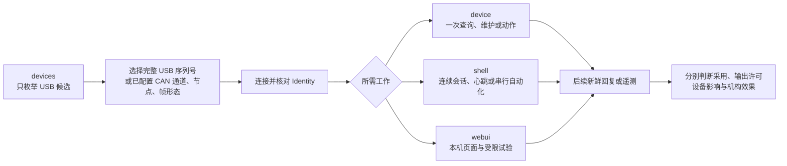
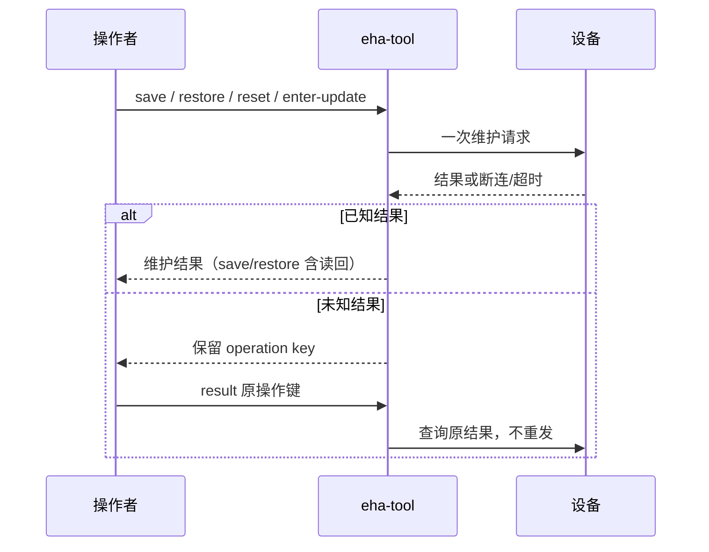

<!-- Copyright The eha-sdk Contributors -->

# `eha-tool`

`eha-tool` 是 EHA 的官方命令行工具，提供单次 CLI、持久 Shell 和本机 WebUI。它通过
[`eha-sdk`](../../README.md)访问**明确选择**的控制器；协议、配置格式和客户接入规则仍由 SDK
维护。本文说明工具旅程和资源边界；精确的命令、参数、默认值和版本以
`eha-tool --help` 及对应子命令的 `--help` 为准。构建、安装和检查入口见
[根贡献指南](../../CONTRIBUTING.md)。

## 使用方式

### 命令行

先选入口，再建立证据：



枚举不会打开设备或扫描总线，不能说明连接或 Identity 已核对。`device` 的每个动作新建本地
会话、核对 Identity、执行一个动作后关闭本地句柄；单次调用返回后不保留会话或心跳。USB 目标使用完整
序列号；CAN 目标必须给出 `--can-channel` 与 `--node`，可选 `--can-mode classic|fd`（默认 `fd`）和
`--can-python` 指定带 `python-can` 的解释器。通道上下文、设备权限和总线参数由部署方的系统／驱动层配置；
`--can-mode` 必须匹配设备实际启动的 Classic／FD 帧形态，不设置主机速率。详见 [CAN 接入指南](../../CAN接入指南.md#主机-can-通道)。

| 需要 | 入口 | 关键边界 |
| --- | --- | --- |
| 本地完整配置检查 | `config-check FILE` | 不访问设备。 |
| 候选发现 | `devices` | `--json` 供自动化；只枚举 USB 候选，不发现 CAN 设备。 |
| 单次查询、维护或控制提交 | `device TARGET ACTION` | 动作前核对 Identity；`--timeout-secs` 默认 5 秒；`device --json` 输出结构化结果。 |
| 单次观察或心跳 | `device TARGET telemetry SECONDS`、`heartbeat-test SECONDS` | 前者不启动心跳或提交控制；后者只显式启停心跳，不发送 Stop。 |
| 连续会话或串行自动化 | `shell` | 同一 SDK 会话可保留心跳和缓存遥测。 |
| 本机页面、试验和记录 | `webui` | 仅监听 `127.0.0.1`。 |
| ODrive USB 只读快照 | `odrive` | 与 H723 会话独立，不控制设备。 |

以下值是占位符，执行前必须替换为已核对的实际目标。CAN 上下文是部署方在外部驱动中配置的名称，
不是设备路径、厂商名或工具可枚举的标识。

```sh
export EHA_USB_SERIAL='实际完整 USB 序列号'
export EHA_CAN_CHANNEL='EHA_PRODUCTION'
export EHA_CAN_NODE='实际 Customer CAN 节点号'
export EHA_CAN_MODE='fd'

eha-tool devices --json
eha-tool device --usb "$EHA_USB_SERIAL" inspect
eha-tool device --can-channel "$EHA_CAN_CHANNEL" --node "$EHA_CAN_NODE" --can-mode "$EHA_CAN_MODE" status
```

`inspect --json` 只输出身份、运行实例和更新路由；`--version` 不访问设备。无参数仅在标准输入和输出
都是终端时进入 Shell；管道或重定向中无参数只显示帮助。

#### 控制与停止

`position MM`、`velocity MM_S`、`force N` 与
`impedance EQUILIBRIUM_MM STIFFNESS_N_PER_MM DAMPING_NS_PER_MM` 都提交持续目标；`velocity 0`
仍是速度目标。提交结果仅表示本地 I/O 完整提交，不能证明设备采用、输出允许、ODrive 执行或机构运动。
进程退出、超时、断连、关闭连接或停止心跳都不表达停止意图；普通停止必须对同一设备显式执行 `stop`。
之后读取本次目标之后的新遥测，结合目标、输出条件、接收年龄和未知影响判断设备事实。

```sh
eha-tool device --usb "$EHA_USB_SERIAL" position 12.5
eha-tool device --usb "$EHA_USB_SERIAL" velocity 1.0
eha-tool device --usb "$EHA_USB_SERIAL" force 100.0
eha-tool device --usb "$EHA_USB_SERIAL" impedance 12.5 5.0 0.2
eha-tool device --usb "$EHA_USB_SERIAL" stop
```

`velocity-test MM_S SECONDS` 是唯一内建的短时速度编排：速度必须是非零有限值，时长 1 至 10 秒，且
不超过从实际 Startup 配置读取的速度软幅值。它核对 Identity、Startup、初始 Idle 和通路联系，显式启停
心跳、显式发送一次 Stop 并等待停止条件；不支持 `--json`。成功只说明该流程的通信和停止条件，不能替代
机构行程、负载或安装条件的核对。

```sh
eha-tool device --usb "$EHA_USB_SERIAL" velocity-test 1.0 2
```

#### ODrive USB 只读

ODrive USB 是独立只读入口：不清错、重启、保存、标定、喂狗或提交控制，也不能证明 H723 与 ODrive
之间的 CAN 状态。`--python PATH` 必须指向带 `odrive==0.5.1.post0` 的解释器；省略时依次使用
`EHA_ODRIVE_PYTHON`、`python3`。`--timeout-secs` 范围为 1 至 60，`--json` 在失败时也输出 JSON。

```sh
eha-tool odrive devices
eha-tool odrive status --serial 0x0123456789AB
eha-tool odrive --python /path/to/python --timeout-secs 10 --json status --serial 0x0123456789AB
```

#### 持久 Shell

`eha-tool shell`（或终端中的无参数调用）持有一个 SDK 会话。先用 `device list` 取得候选，以完整序列号
或该次列表中的短数字序号 `device select`，再 `device connect`；CAN 直接使用
`device connect-can CONTEXT NODE [classic|fd] [PYTHON]`。连接和 `device reconnect` 都核对 Identity。
`device show`、`device clear`、`device snapshot`、`device disconnect` 管理本地选择或会话；Shell 不发现 CAN
设备，`CONTEXT` 由外部驱动配置。

| Shell 工作 | 命令 | 边界 |
| --- | --- | --- |
| 查询 | `status`、`measurements`、`diagnostics`、`telemetry` | `telemetry` 只读缓存，不发查询；`wait SECONDS` 只本地等待。 |
| 联系 | `heartbeat-start`、`heartbeat-stop`、`heartbeat-once` | 启停心跳不停止控制。 |
| 持续目标与普通停止 | `position`、`velocity`、`force`、`impedance`、`stop` | 仍须显式 `stop`。 |
| 配置与维护 | `config check FILE`、`config validate FILE`、`config-read`、`config-save`、`restore-factory`、`result`、`release`、`reset-application`、`enter-update` | `config check` 不连接；`config validate` 要先连接。其余规则见[配置与维护](#配置与维护)。 |

`disconnect`、`reconnect`、`quit` 和关闭 Shell 只管理本地连接，不会发送 Stop、Reset 或重放动作。交互式
Shell 按 shell 语法分词但不展开环境变量；用 `help`、`help device`、`help config` 查询精确帮助。

`shell --script FILE` 与 `shell --batch` 共用一个会话，逐行执行并在首个错误停止，绝不重发。批处理忽略
空行和以 `#` 开头的整行；交互 Shell 的 `#` 不是注释。批处理中的 `help` 以非零状态结束，因此应预先
查看帮助。每个脚本自行完成候选选择与连接。

```sh
eha-tool shell --script ./session.eha
eha-tool shell --batch <<EOF
device list
device select "$EHA_USB_SERIAL"
device connect
status
EOF
```

#### 配置与维护

`config-check` 完成 SDK 静态配置检查；字段、schema 和换算规则见
[SDK 配置检查](../../README.md#配置检查)。通过不代替设备身份、通信、写后读回或运行
条件核对。`config-read --view` 接受 `factory`、`user`、`startup`、`communication`；仅完整 UTF-8 的非
`communication` 记录可用 `--output` 创建新文件，且工具不覆盖已有文件。Shell 使用 `config-save FILE` 和
`config-read --view VIEW`，不提供 `--output` 导出。



`save` 的完成结果含同设备用户记录的读回；保存不会自动复位、采用新 Startup 配置或释放维护结果。
`restore-factory`、`reset-application` 和 `enter-update` 也返回操作键。超时、断连或未知结果时保留原
72 位十六进制操作键，用 `result --operation-key KEY` 查询；**绝不自动重发**原维护操作。`release` 只释放
已结清结果，并再次读取确认。`enter-update` 只请求进入已交付更新入口，不传输镜像；镜像传输、DFU 对象
核对和新应用启动核对由外部更新流程负责。

```sh
eha-tool device --usb "$EHA_USB_SERIAL" config-read --view user --output ./before.json
eha-tool device --usb "$EHA_USB_SERIAL" save ./candidate.json
eha-tool device --usb "$EHA_USB_SERIAL" result --operation-key '保存返回的操作键'
eha-tool device --usb "$EHA_USB_SERIAL" release --operation-key '已结清的操作键'
eha-tool device --usb "$EHA_USB_SERIAL" restore-factory
eha-tool device --usb "$EHA_USB_SERIAL" reset-application
eha-tool device --usb "$EHA_USB_SERIAL" enter-update
```

### Web UI

`webui` 持有独立的 USB 和 CAN 持久 SDK 会话，只监听 `127.0.0.1`，默认地址为
`http://127.0.0.1:8080/`。跨主机访问应以符合部署访问控制要求的端口转发访问同一回环端口。
浏览器打开、刷新、关闭、切换当前通路或关闭本地连接都不会发送目标、Stop 或 Reset。

```sh
eha-tool webui
eha-tool webui --port 8081
eha-tool webui --odrive-python /path/to/python
eha-tool webui --runs-dir /path/to/eha-runs
```

| 页面或操作 | 行为与边界 |
| --- | --- |
| 总览与连接 | 刷新候选只作用于 USB；CAN 填写外部驱动的通道上下文、实际节点、`classic`／`fd` 帧形态和可选 Python 解释器。连接/重连核对 Identity；关闭只关闭该通路。USB、CAN 的会话、心跳、草稿和维护操作键分开保存。 |
| 诊断与遥测 | 状态、测量、诊断和被动遥测均对应当前操作通路。图表的旧数据、缺失值和未知影响不能证明当前输出或实际执行；暂停绘图只影响浏览器展示。 |
| 普通控制 | 先启用当前通路心跳，再提交已选定的位置、速度、力或阻抗参数。提交只到本地发送边界；停止心跳、关闭页面或断开连接不会停止控制，普通停止须点“停止控制”。 |
| 配置和维护 | 表单只按当前 Schema 编辑/比较，完整 JSON 原文是唯一完整记录；导入和导出都不访问设备。保存前校验完整 JSON，保存后以读回为准。未知结果保留操作键并查询原结果，不重发；断连不能证明新应用或更新入口已启动。 |
| ODrive USB | 可按需独立发现和读取，不自动轮询；其快照和 H723 所见摘要是独立证据。读取工作者串行执行，忙碌返回忙碌而不阻塞 H723 会话。 |

#### 配置表单、原文与差异

读取设备视图会更新当前草稿；“导入候选”只载入本地文件，“导出原文”只下载当前草稿。字段表单和
原文互相同步并标示未保存差异，但差异、导入成功或浏览器下载不代表配置已采用。只有“保存并读回”的
维护结果说明本次设备操作已取得的事实；它仍不自动复位、采用新的启动配置或释放维护结果。

#### 曲线、目标与反馈

曲线仅来自当前通路的被动遥测窗口。位置、速度、力曲线同时显示固件报告的对应目标，压力 A/B 保留在
遥测与运行记录中。时间缺口、缺失值、图表连续或最后一次本地提交都不能证明目标已采用、ODrive 已执行
或机构已运动。

#### 试验与普通持续目标

普通控制是持续目标，不附带 PC 侧试验包络或自动停止。独立“试验”流程仅约束本次主机请求：先读取实际
Startup 与 Status 作只读预检，全部通过才提交一次试验目标，包络不写入设备配置。每次试验受本次最大时长
限制；位置可设到位容差与稳定时间，滑块至多 20 Hz 合并最新位置请求，不能绕过包络。

试验停止始终显式发送一次 Stop，只以 Stop 后的**新鲜**遥测确认目标清除和停止状态。时长结束、到位、
显式停止、提交失败或未知结果都要查看试验状态及后续遥测；工具不会重放目标或 Stop。试验期间勿并发普通
控制或阻塞查询；先读取快照，或通过试验入口更新位置、停止试验。

#### 共享 CAN 与多节点试验

一个外部 CAN 通道可承载多个明确选择的节点，但每个节点有独立身份、会话、心跳、遥测与结果，不能相互替代。
扫描范围为 0 至 127，只查询 Identity、不启心跳；已有会话保留心跳或持续目标时，先显式停止并核对、关闭
心跳后再扫描。外部驱动通道故障结束所有节点的本次连接，不会自动重开、切换设备或重放动作；重新可用后须
由部署方确认驱动状态，再显式重连指定节点并重新核对身份，其余节点仍断开，心跳和目标均须另行操作。

群组试验的每个成员都要独立通过只读预检，任一失败即不提交群组需求。提交或停止结果按节点分别显示；
部分提交、部分停止、超时或未知结果时，不自动重试、补发或归纳为成功。群组开始后的“停止本次试验”使用
服务保留的原成员范围，不随当前勾选缩小。

#### 运行记录

`--runs-dir` 指定记录根目录；省略时使用系统用户数据目录下的 `eha-tool/runs`：优先
`XDG_DATA_HOME`，macOS 为 `~/Library/Application Support/eha-tool/runs`，Windows 为
`%LOCALAPPDATA%/eha-tool/runs`，其他系统为 `~/.local/share/eha-tool/runs`。

开始记录要求当前通路有已核对 Identity 的活跃会话，并只读取得 Startup 配置；应在试验前开始。开始/停止
记录不发送控制、心跳、Stop、Reset 或维护动作。每次运行使用独立目录，含 `metadata.json`（工具、连接、
身份、UID、运行 nonce、Startup 原文及来源）、`events.jsonl`（顺序事件）和 `telemetry.csv`（时间、序号、
目标、反馈、`gap` 与完整遥测 JSON）。页面“原始结果”仅展示最近操作，不是持续日志；服务日志输出至启动
服务的标准输出/错误。

`gap` 或 dropped 说明遥测丢失，不能补作连续测量。浏览器关闭、刷新或暂停绘图不删除已写入样本；停止记录
只完成文件，不改变连接或控制。关闭连接、传输断开或身份/运行实例变化会结束记录而不混入新身份数据，也
不发送 Stop。写入失败会保留部分文件，不能当作完整运行记录；记录本身也不能单独证明设备采用、执行、
机械位移或安全条件。

## 结果边界

工具不模拟设备，不隐式停止、复位或重放目标；关闭进程只回收本地资源。配置导出仅在固件报告完整记录时
创建新文件，不覆盖已有文件；本地写入失败可能留下不完整文件。设备适用性、安装条件、保护结果和机构效果
须由相应产品流程与操作之后的新设备证据核对。
