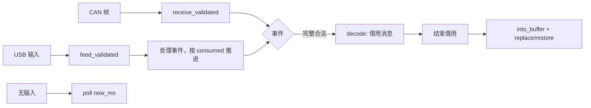

<!-- Copyright The eha-sdk Contributors -->

# `transport`

## 职责与依赖

`transport` 将一条完整公共消息绑定到 CAN Classic、CAN FD 或 USB Bulk。它是无堆分配的 `no_std` 库，只依赖 [`protocol`](../protocol/README.md) 完成公共格式判断；CAN 和 USB 承载规则分别以 [CAN 合同](../../docs/通信协议/CAN通信绑定.md)与[USB 合同](../../docs/通信协议/USB通信绑定.md)为准。

调用方拥有真实 I/O、单调时钟、连接/控制器阶段和业务入口。本 crate 只做组装、封装、期限、相邻编号保护及本地 I/O 事件，不做控制、保存、重放或业务恢复。只有完整合法的 `Heartbeat` 才可由调用方刷新实际入口的联系事实；其他消息的业务规则见[SDK README](../../README.md#公共交互与结果)。

## 公开接口与使用

### 接收：持续推进、交接缓冲

CAN 用 `receive_validated(frame, now_ms, generation)`，USB 用 `feed_validated(phase, input, now_ms)`。每次返回都先处理事件；USB 再按 `consumed` 推进剩余输入，直到切片耗尽。即使没有新输入，也必须调用 `poll(now_ms)`，使半条消息和 COBS 块按**绝对期限**过期。

完成事件交出 `ValidatedCompletedMessage`：它持有原组装缓冲，`decode()` 不重复校验；处理后必须消费证明，用 `into_buffer()` 配合 CAN `replace_buffer` 或 USB `restore_buffer` 归还 lane。USB 的 `StalePhase`/`PhaseExhausted` 要停止处理旧阶段输入，或重建耗尽对象；缓冲尚被证明持有时不能重配，大消息被取走后，补入足够空闲缓冲前该 lane 不会继续接收。兼容的 `receive`、`feed`、`message` 与 `take_completed` 仍可用于同步调用。

### 发送：令牌只推进本地事实

调用方在 crate 提供的 lane 缓冲原位编码并冻结消息：CAN 依次 `next_frame`、提交驱动并以 `complete(token, result, now_ms)` 回报；USB 依次 `prepare_packet`、在端点接纳后 `accepted(token)`、在写调用完成后 `completed(token, now_ms)`。`FrameAccepted`、`MessageCommitted` 和 USB 的 `accepted`/最后一包 `completed`都是本地 I/O 事实；上层形成的 `LocalSubmission` 也只表示本地提交，不能说明物理 ACK、对端接收、目标采用、设备执行或业务完成。

### 连接变化：先隔离旧 I/O

CAN 在 Bus-Off、控制器复位、重新装配或设置变化时使用严格递增的 `generation`；USB 使用新的 `Phase`。未知 I/O 结果时，先停止或隔离旧 I/O，再调用 `reconfigure`/`phase_changed`，或消费 `into_reconnect_state(now_ms)` 后以新的调用方缓冲 `from_reconnect_state`。重连状态不含大缓冲、半条消息或未交付完整消息，不能复制或跨进程持久化；它只保留世代/阶段、下一个本地序号和编号保护窗口。不得据此自动重发可能有副作用的消息。

## 实现约定

CAN 与 USB 的组装、传输阶段和编号保护彼此独立，完整消息在交付前只在所属绑定中处理。公共 CRC、方向、精确长度和字段条件由 `protocol` 统一判断；本 crate 判断承载封装、组装、期限和阶段归属。内存、调度和吞吐由调用方环境决定。

## 错误与结果边界

无关输入、部分消息、相关非法输入和完整合法消息分别报告，半条或非法消息不交付。传输失败、取消、阶段变化或重连导出会清理未交付的传输状态并保留编号保护；它们不撤回已交给控制器/端点的字节，也不改变业务维护结果或未知影响。设备操作结果未知时，保留业务键，重连后按 SDK 流程识别并查询实际状态，不自动重发。

## 代码与验证入口

精确的类型、容量和调用前提见 CAN/USB rustdoc。[`examples/roundtrip.rs`](examples/roundtrip.rs)展示三种承载的逐次本地提交；[`examples/handoff.rs`](examples/handoff.rs)展示心跳、最新消息与缓冲交接；`tests/` 覆盖缓冲、期限、重连和发送场景。检查入口见[贡献指南](../../CONTRIBUTING.md)。示例只运行宿主内存流程，不访问真实驱动或设备。
