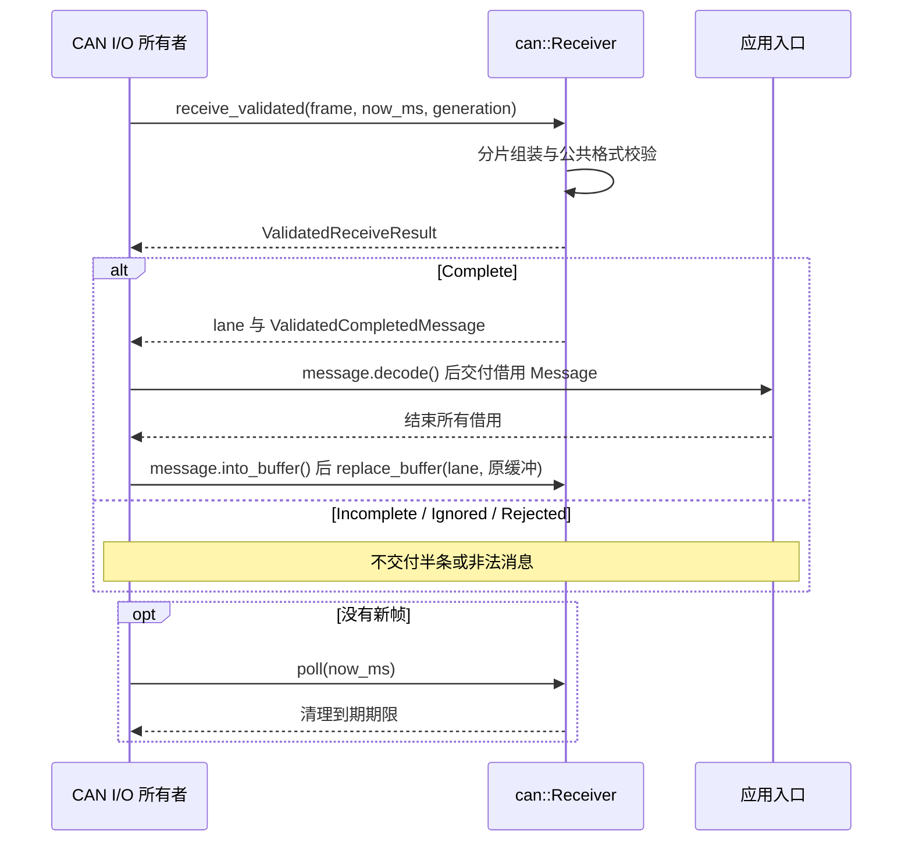
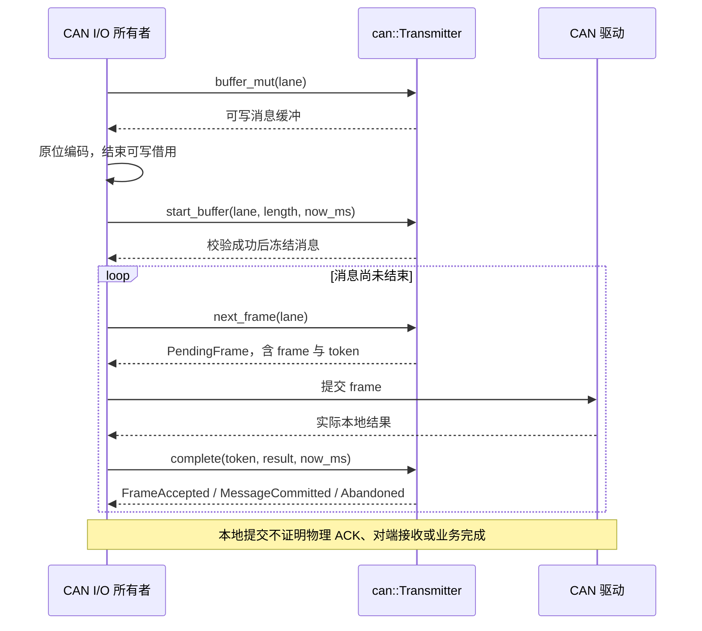
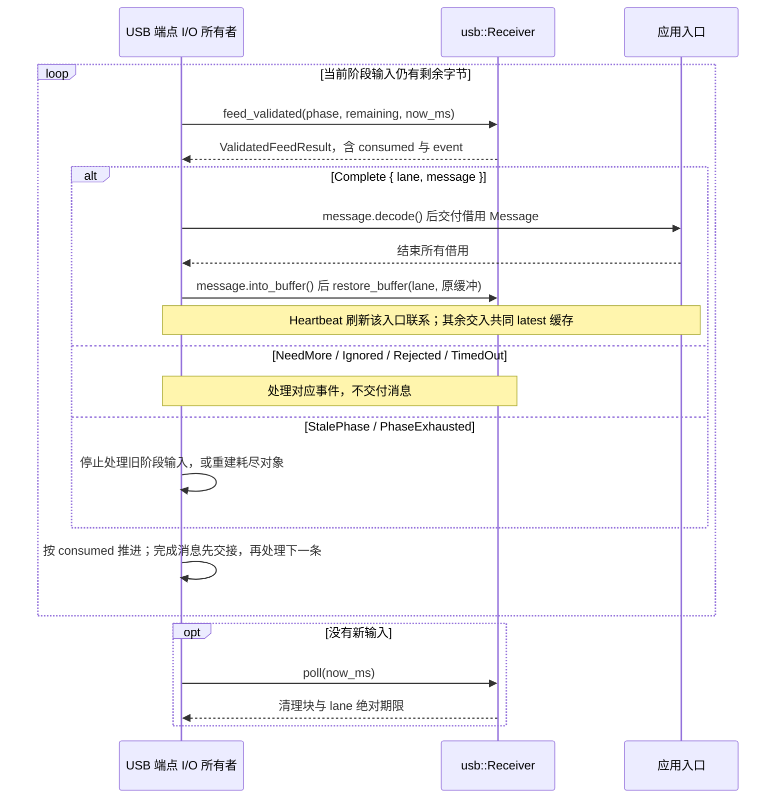
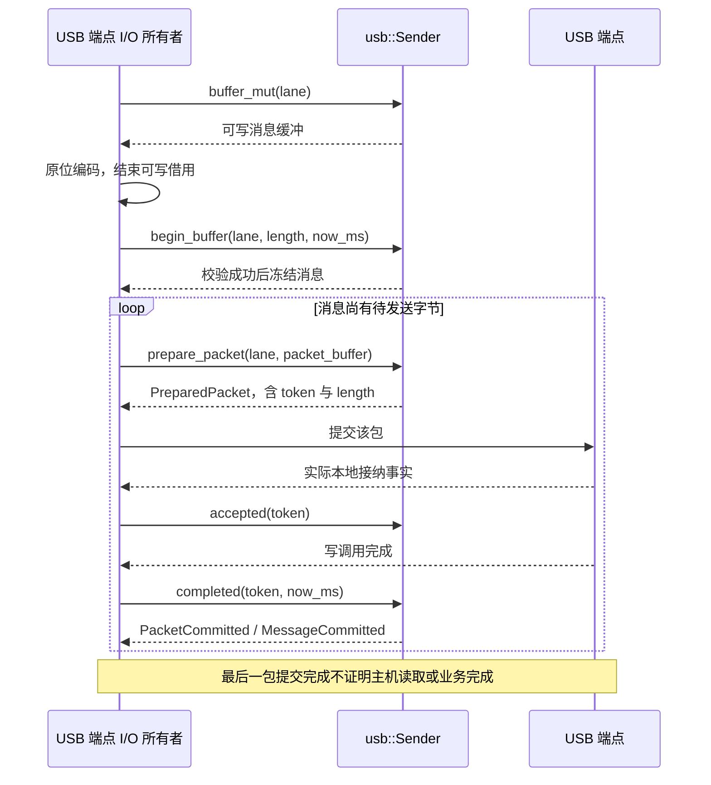

<!-- Copyright The eha-sdk Contributors -->

# `transport`

## 职责与依赖

本库把同一条完整公共消息绑定到 CAN Classic、CAN FD 或 USB Bulk，使用 `no_std` 且不分配堆内存。它只依赖 [`protocol`](../protocol/README.md) 的公共格式判断；线上承载规则分别由 [CAN 合同](../../docs/通信协议/CAN通信绑定.md)和[USB 合同](../../docs/通信协议/USB通信绑定.md)唯一维护。

调用方拥有实际 I/O、单调时钟、连接或控制器阶段和业务入口。本库组装、封装、保护相邻传输编号并记录本地 I/O 事件；它不执行控制、许可、保存、重放或业务恢复。只有**完整合法**的 `Heartbeat` 才可由调用方刷新其实际入口的联系事实；其他完整用户指令的最新覆盖和业务处理规则见[SDK README](../../README.md#公共交互与结果)。

## 公开接口与使用

CAN 接收 `Frame`、时间和世代，USB 接收当前 `Phase`、有序字节和时间。两个接收器都必须在没有新输入时调用 `poll` 推进绝对期限。`receive_validated` 与 `feed_validated` 在完成时转交同一 `ValidatedCompletedMessage`，它经 `can::ValidatedCompletedMessage` 和 `usb::ValidatedCompletedMessage` 两个兼容路径公开：持有原组装缓冲，将已经校验的字节、方向和摘要绑定在同一证明中，并以 `decode()` 产生借用消息而不重算 CRC；处理结束后消费证明归还原缓冲。旧 `receive`、`feed`、`message` 和 `take_completed` 保留给同步兼容调用。发送时，调用方在库提供的缓冲原位编码并冻结消息，随后只在实际 I/O 返回对应事实时推进令牌。

接收图中的应用入口取得已校验的完整原始字节与消息摘要；需要读取具名字段时，按 [`protocol` 的解码流程](../protocol/README.md#公开接口与使用)取得 `Message` 与回复视图。

CAN 接收与缓冲交接：

CAN 发送与本地提交：

USB 接收需在每次 `feed` 返回后处理事件，再推进输入切片：

USB 发送图展示能够取得明确本地接纳和完成事实的路径；未知结果按下节的阶段边界处理：

USB 的 `FeedResult::consumed` 可只消费前导零，或在一条消息完成处停止；调用方必须用剩余字节继续调用，即使 `event` 为 `Ignored`。`Phase` 和发送令牌只标识本地传输，不是对端身份、控制目标身份或维护会话键。

连接资源需要在同一调用方运行内重建时，先结束或隔离旧 I/O，再消费 `into_reconnect_state(now_ms)` 返回的 CAN `TxReconnectState`／`RxReconnectState` 或 USB `SenderReconnectState`／`ReceiverReconnectState`，并用新的调用方缓冲调用对应 `from_reconnect_state`。状态不含大缓冲、半条消息或完整未交付消息，且不可复制；它保留严格递增的 CAN 世代或 USB 阶段、下一个传输／本地 I/O 序号和编号保护窗口。它只能在当前运行内移动，不是跨进程持久化格式。

## 实现约定

调用方提供接收与 I/O 缓冲。CAN 与 USB 的组装、传输阶段和编号保护彼此独立；完整消息
在交付前只在相应绑定中处理。`ValidatedCompletedMessage` 仍借用原缓冲时，CAN
`reconfigure` 返回 `LaneBusy`，USB `phase_changed` 返回 `PhaseError::BufferBusy`，调用方
必须先结束该借用再复用或切换阶段。大消息被取走后，只有补入足够的空闲缓冲才能继续该
通道。具体内存、调度和吞吐取决于调用方环境，不是本 crate 的公开承诺。

## 错误与结果边界

无关输入、部分消息、相关非法输入和完整合法消息分别报告；半条消息不交付。公共格式的 CRC、类型、方向、精确长度和字段条件统一由 `protocol` 判断，绑定只判断承载封装、组装、期限和阶段归属。传输失败、取消、阶段改变或重连状态导出都会清理未交付传输状态并保留编号保护，不改变业务维护结果或未知影响。

生成待发送帧或包不表示驱动已经接纳。CAN 的 `FrameAccepted`、`MessageCommitted` 以及 USB 的 `accepted`、最后一包 `completed` 都仅证明相应的本地 I/O 事实。无法确认 CAN I/O 是否接纳时，调用方先隔离旧 I/O，再以严格递增世代调用 `reconfigure`；USB 则先隔离旧 I/O，再调用 `phase_changed`。两者都不能证明物理 ACK、对端收到完整消息、设备执行或业务完成，也不能据此自动重发副作用。

## 代码与验证入口

[`src/can/mod.rs`](src/can/mod.rs) 导出 CAN 公共路径；[`types.rs`](src/can/types.rs) 定义共享帧和公开类型，[`receive.rs`](src/can/receive.rs) 维护组装、期限与世代隔离，[`transmit.rs`](src/can/transmit.rs) 维护快照、分片和本地提交令牌，[`wire.rs`](src/can/wire.rs) 保持私有 CAN ID、DLC 与载荷规则。

[`src/usb/mod.rs`](src/usb/mod.rs) 保留 USB 公共路径；[`types.rs`](src/usb/types.rs) 定义公开类型与内部状态，[`receive.rs`](src/usb/receive.rs) 维护接收、保护与绝对期限，[`send.rs`](src/usb/send.rs) 维护发送阶段和流分片，[`cobs.rs`](src/usb/cobs.rs) 提供 COBS 与分段助手。[`src/guard.rs`](src/guard.rs) 提供有界传输编号保护；[`tests/can.rs`](tests/can.rs) 汇集 [`buffers`](tests/can/buffers.rs)、[`isolation`](tests/can/isolation.rs)、[`receive`](tests/can/receive.rs)、[`reconnect`](tests/can/reconnect.rs)、[`route`](tests/can/route.rs) 与 [`transmit`](tests/can/transmit.rs)，[`tests/usb.rs`](tests/usb.rs) 汇集 [`capacity`](tests/usb/capacity.rs)、[`long_transfer`](tests/usb/long_transfer.rs)、[`receive`](tests/usb/receive.rs)、[`reconnect`](tests/usb/reconnect.rs) 与 [`send`](tests/usb/send.rs) 场景。

[`roundtrip`](examples/roundtrip.rs) 演示三种承载上的逐次本地提交和连接变化；[`handoff`](examples/handoff.rs) 演示实际入口心跳和接收缓冲所有权交接。开发环境与通用命令见[贡献指南](../../CONTRIBUTING.md)；单独检查使用 `-p protocol -p transport`。示例只运行宿主内存流程，不访问驱动或设备。
